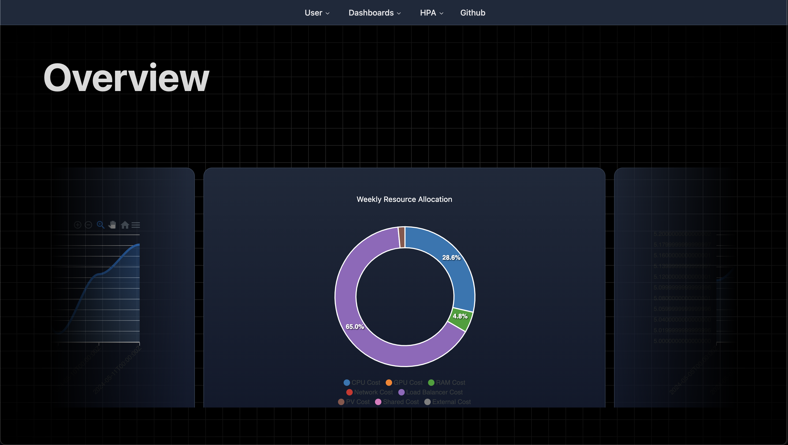
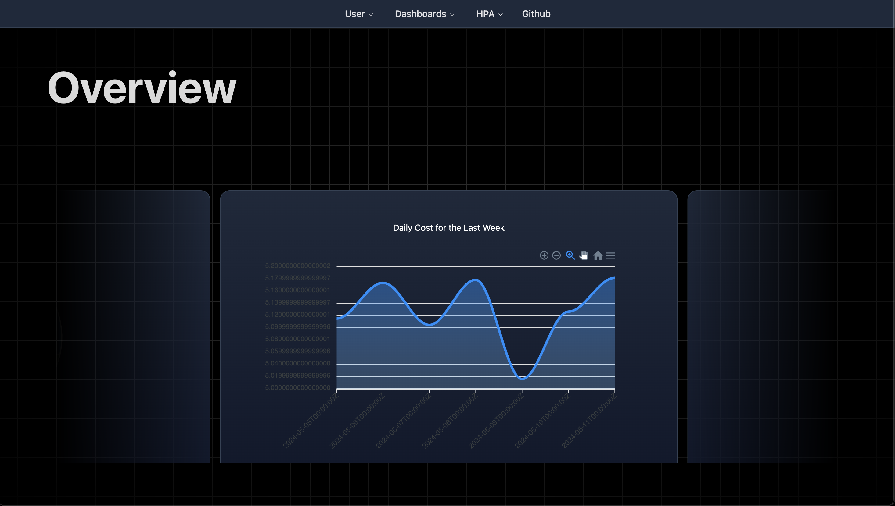
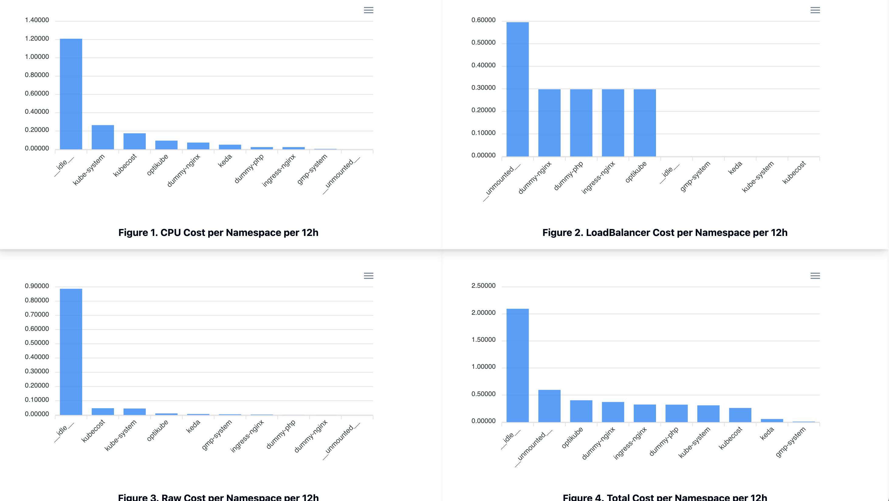
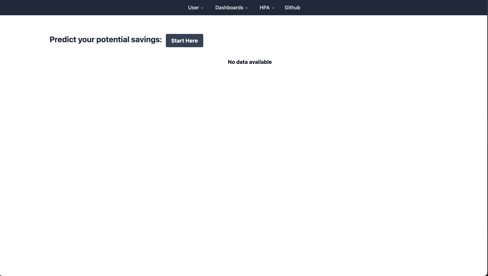
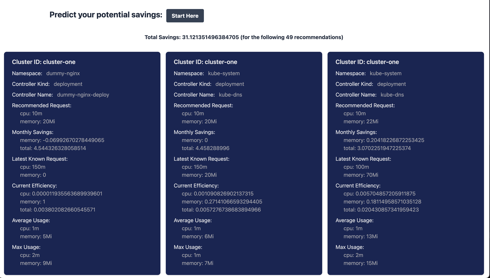
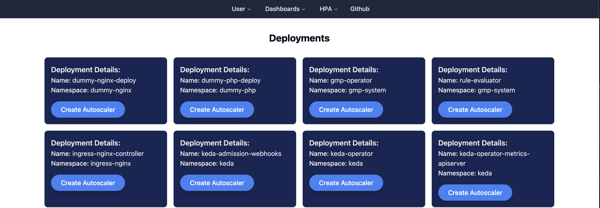
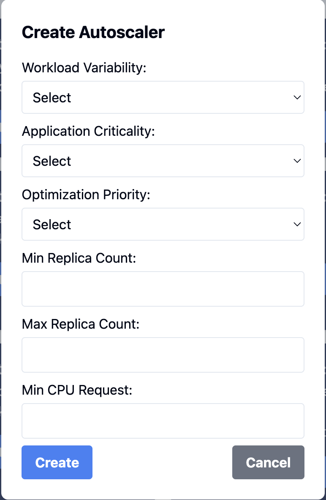

  
# OptiKube (Client Side)

 This is codebase for Front End of Optikube 

---

## Contributions

Contributions play a vital role in the open-source community and would be welcomed! If you'd like to contribute to OptiKube please follow the steps below.

- Fork the project.
- Create and work off of your feature branch.
- Create a pull request with a detailed description of your changes using our template to merge your feature branch into dev.
- We will review it and get back to you!

## Landing Page

Once you have successfully installed OptiKube, upon start up, you will see the landing page.

Click "To Dashboard" to start managing your cluster!

## Navigation Bar

The navigation bar highlights a few things:

- **User**: This will lead you to the User Dashboard.
- **Dashboards**: This is where you can access the Metrics, Cost, and Savings Dashboard.
- **HPA**: This is where you can customize the parameters for autoscaling of your cluster.
- **GitHub**: This hyperlink will allow you to access the GitHub to OptiKube.

## User Dashboard

When you get past the landing page, you will be in the User Dashboard. Here is where you will get high-level information regarding your cluster.

One of the charts you will see gives you an overview of your resource allocation for the week.

**Weekly Resource Allocation**

The chart will give you a breakdown of 8 categories if and when it is applicable:

- CPU Cost
- GPU Cost
- RAM Cost
- Network Cost
- Load Balancer Cost
- PV Cost
- Shared Cost
- External Cost

You can hover over each section to further clarify any analytics provided.

**Daily Total Cost**

This chart will provide you with the daily total cost of your cluster for the last 7 days (rolling).

## Metrics Dashboard

Here is the metrics dashboard which will showcase 6 categories for you:

- cpuCores
- gpuCount
- ramBytes
- networkTransferBytes
- pvBytes
- totalEfficiency(%)

You can choose to display these metrics in varying time frames as well:

- 1 Day
- 7 Days
- 15 Days
- 30 Days

## Cost Dashboard

This dashboard will allow you to see varying costs throughout your cluster:

- CPU Cost
- Load Balancer Cost
- Raw Cost
- Total Cost

You will also be able to decide how to view these costs utilizing the different dropdowns similar to the other dashboard.

You can view it by:

- Namespace
- Nodes
- Deployment

You can adjust the time frames as well to:

- 12 hours
- 1 Day
- 3 days
- 7 Days
- 30 Days

This information will allow you to determine what parameters or actions you need to take.

## Savings Dashboard

This Dashboard provides the estimated monthly saving and sizing recommendations for the resource requests based on the Time Frame, CPU Algorithm, RAW Algorithm, and Target CPU Utilization. The recommendation card is sorted by total savings.

1. Click the "Start Here" button. 

2. Select each parameter based on the options. 

   a. **Time Frame**: Duration of time over which to query. Allowable options include 3 days, 7 days, 14 days, 21 days, 30 days, 60 days, and 90 days.  

   b. **CPU Algorithm**: The algorithm to be used to calculate CPU recommendations.  

   _Max_ recommendations are based on the maximum-observed usage in the time frame.   _Quantile_ recommendations are based on a quantile of observed usage in the time frame. When Quantile is selected, the qCPU will default to 0.95. Default to Max. 

   c. **RAW Algorithm**: The algorithm to be used to calculate RAW recommendations.
   _Max_ recommendations are based on the maximum-observed usage in the time frame.   _Quantile_ recommendations are based on a quantile of observed usage in the time frame. Default to Max. 

   d. **targetCPUUtilization**: A ratio of headroom on the base recommended CPU request.  

3. Get the results of estimated monthly savings, count of recommendations, and recommendation details.

## HPA Dashboard

This Dashboard enables setup for custom autoscalers for your deployments. When users configure a Kubernetes Event-Driven Autoscaler (KEDA) scaler in Optikube, they input various optimization parameters that directly influence how the application behaves under different load conditions. Based on these inputs, a weighted optimization score is calculated and stored along with the configuration settings in a Redis database. This score is instrumental in determining which of the three optimization strategies — Balanced, Cost Efficient, and Performance — is applied to the Kubernetes deployment. 

1. Locate your Deployment in the Dashboard.  

2. Click "Create Autoscaler"  

3. Select the parameters. 

   

   a. **Workload Variability**:  
   _Steady_: Predictable traffic allows for higher CPU utilization targets (70-80%) and tighter control over requests and limits. This setup optimizes resource use without risking performance during minor fluctuations.  
   _Variable_: With occasional spikes in traffic, moderate CPU utilization targets (50-70%) are set, with a larger gap between requests and limits to accommodate expected peaks without over-provisioning during quieter periods. 
   _Dynamic_: Unpredictable, significant traffic fluctuations necessitate lower CPU utilization targets (40-60%) to ensure capacity for sudden increases. Requests are conservatively set to cover minimal service needs, with much higher limits to handle unexpected spikes. 

   b. **Application Criticality**: 
   _Non-Critical_: Higher CPU utilization is acceptable as temporary performance drops are tolerable. This setting is cost-effective, prioritizing economical resource use over immediate responsiveness. 
   _Moderately Critical_: Balances resource allocation to ensure stability without excessive spending, suitable for applications where some level of performance degradation can be managed. 
   _Critical_: Low CPU utilization targets prioritize immediate response to increased demand to prevent any performance issues, essential for operations where even minimal downtime can have significant repercussions. 

   c. **Optimization Priority**: 
   _Cost Efficiency_: Higher CPU utilization and tighter requests/limits are set to reduce costs, making it an optimal choice for steady, non-critical applications. 
   _Balanced_: This flexible approach adjusts target utilization and request/limit settings to maintain adequate performance while managing costs, suitable for variably loaded systems. 
   _Performance_: Emphasizes availability of resources with lower utilization targets and more generous requests and limits, ensuring that critical and dynamic workloads are supported without compromise. 

   d. **Min Replica Count**: 
   Minimum number of replicas of the workload. 

   e. **Max Replica Count**: 
   Maximum number of replicas of the workload. 

   f. **Min CPU Request**: 
   Minimum amount of CPU resources requested from the Kubernetes cluster scheduler. 

4. Create your Autoscaler. 

For the same Deployment, you can also perform "update" and "delete" operations on the Deployment. For the min CPU request, you can refer to the Recommended Request for CPU from the Savings Dashboard!

## Creators

| Name          | GitHub | LinkedIn |
|:-------------:|:------:|:--------:|
| **Andy Guajardo** |  |  |
| **Cheryl Lee** |  |  |
| **George Huang** |  |  |
| **Josh Bajarias** |  |  |
| **James Shea** |  |  |
